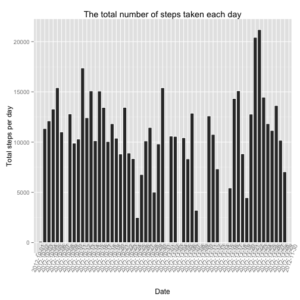
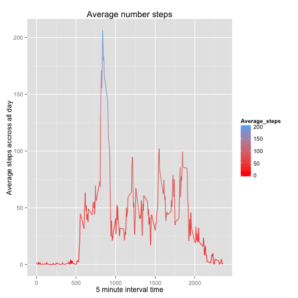
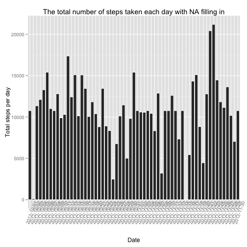
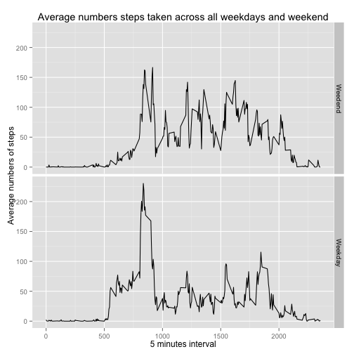

---
Reproducible Peer Assessments 1
===========================================

##This is an R Markdown document for reproducible peer assessments 1

Let's load data first.

```r
library(dplyr)
library(ggplot2)
#library(plyr)
#read data
data <- read.csv("activity.csv", head = T, stringsAsFactor = F)
```

###Question 1: What is mean total number of steps taken per day?

(1) Calculate the total number of steps taken per day.

```r
#part 1: calculate total steps taken per day
total.steps <- data %>%
        group_by(date) %>%
        summarize(total.steps = sum(steps, na.rm = T) )
names(total.steps)[2] <- "total"
total <- total.steps$total
total.steps
```

```
## Source: local data frame [61 x 2]
## 
##          date total
## 1  2012-10-01     0
## 2  2012-10-02   126
## 3  2012-10-03 11352
## 4  2012-10-04 12116
## 5  2012-10-05 13294
## 6  2012-10-06 15420
## 7  2012-10-07 11015
## 8  2012-10-08     0
## 9  2012-10-09 12811
## 10 2012-10-10  9900
## ..        ...   ...
```

(2) The plot for question 1 is presented below.


```r
#make a histogram
ggplot(total.steps, aes(x = date, y = total)) + geom_histogram(stat = "identity", binwidth = 70, color = "white") +
  theme(axis.text.x = element_text(angle = 70)) + xlab("Date") + ylab("Total steps per day") + 
  ggtitle("The total number of steps taken each day")
```

 

(3) Calculate and report the mean and median of the total number of steps taken per day.


```r
#calculate mean and median
data <- group_by(data, date)
mean.steps <- summarize(data, mean(steps, na.rm = T))
median.steps <- summarize(data, median(steps, na.rm = T))
total.daily <- summarize(data, sum(steps, na.rm = T))
names(total.daily)[2] <- "total"
names(mean.steps)[2] <- "mean"
names(median.steps)[2] <- "median"
mean.steps
```

```
## Source: local data frame [61 x 2]
## 
##          date     mean
## 1  2012-10-01       NA
## 2  2012-10-02  0.43750
## 3  2012-10-03 39.41667
## 4  2012-10-04 42.06944
## 5  2012-10-05 46.15972
## 6  2012-10-06 53.54167
## 7  2012-10-07 38.24653
## 8  2012-10-08      NaN
## 9  2012-10-09 44.48264
## 10 2012-10-10 34.37500
## ..        ...      ...
```

```r
median.steps
```

```
## Source: local data frame [61 x 2]
## 
##          date median
## 1  2012-10-01     NA
## 2  2012-10-02      0
## 3  2012-10-03      0
## 4  2012-10-04      0
## 5  2012-10-05      0
## 6  2012-10-06      0
## 7  2012-10-07      0
## 8  2012-10-08     NA
## 9  2012-10-09      0
## 10 2012-10-10      0
## ..        ...    ...
```

###Question 2: What is the average daily activity pattern?

(1) Average number of steps taken by 5 minutes interval, averaged across all days.

```r
#part 2:calculate average steps taken by 5 min interval
interval <- group_by(data, interval)
interval.steps <- summarize(interval, mean(steps, na.rm = T))
names(interval.steps)[2] <- "interval.total"
Average_steps <- interval.steps$interval.total
interval.steps
```

```
## Source: local data frame [288 x 2]
## 
##    interval interval.total
## 1         0      1.7169811
## 2         5      0.3396226
## 3        10      0.1320755
## 4        15      0.1509434
## 5        20      0.0754717
## 6        25      2.0943396
## 7        30      0.5283019
## 8        35      0.8679245
## 9        40      0.0000000
## 10       45      1.4716981
## ..      ...            ...
```

(2) Make a time series plot (i.e. type = "l") of the 5-minute interval (x-axis) and the average number of steps taken, averaged across all days (y-axis)


```r
#make interval.steps as time series
ggplot(interval.steps, aes(interval, Average_steps), breaks = 10) + 
  geom_line(aes(colour = Average_steps)) + scale_colour_gradient(low = "red") + 
  xlab("5 minute interval time") + ylab("Average steps accross all day") + 
  ggtitle("Average number steps")
```

 

(3) Which 5-minute interval, on average across all the days in the dataset, contains the maximum number of steps?


```r
#the max number
max <- max(Total_steps)
interval <- interval.steps[Total_steps == max, ]
```

###Question 3: Imputing missing values.

(1) Calculate and report the total number of missing values in the dataset.


```r
#part 3: sum total NA number
na.total <- sum(is.na(data$steps))
na.total
```

```
## [1] 2304
```

(2) Devise a strategy for filling in all of the missing values in the dataset.

```r
#merge data with interval steps
na.day <- merge(data, interval.steps)
#replace NA with average number by 5 mins interval
na.day$steps = ifelse(is.na(na.day$steps), na.day$interval.total, na.day$steps)

#creat a new data with NA filled with average steps taken in every 5 minutes interval.
data2 <- select(na.day, steps, date, interval)
data2 <- arrange(data2, interval)
data2 <- arrange(data2, date)
head(data)
```

```
## Source: local data frame [6 x 3]
## Groups: date
## 
##   steps       date interval
## 1    NA 2012-10-01        0
## 2    NA 2012-10-01        5
## 3    NA 2012-10-01       10
## 4    NA 2012-10-01       15
## 5    NA 2012-10-01       20
## 6    NA 2012-10-01       25
```

```r
head(data2)
```

```
##       steps       date interval
## 1 1.7169811 2012-10-01        0
## 2 0.3396226 2012-10-01        5
## 3 0.1320755 2012-10-01       10
## 4 0.1509434 2012-10-01       15
## 5 0.0754717 2012-10-01       20
## 6 2.0943396 2012-10-01       25
```

(3) Make a histogram of the total number of steps taken each day and Calculate and report the mean and median total number of steps taken per day. 


```r
#total number taken each day in new data
total.day <- group_by(data2, date)
total2<- summarize(total.day, sum(steps))
names(total2)[2] <- "total2"
#creat histogram of the total number of steps taken each day 
ggplot(total2, aes(x = date, y = total2)) + 
  geom_histogram(stat = "identity", binwidth = 70, color = "white") + 
  theme(axis.text.x = element_text(angle = 70)) + xlab("Date") + ylab("Total steps per day") + 
  ggtitle("The total number of steps taken each day with NA filling in")
```

 

(4) Calculate and report the mean and median total number of steps taken per day.


```r
#calculate mean and median value in data2
data2 <- group_by(data2, date)
mean.steps2 <- summarize(data2, mean(steps))
median.steps2 <- summarize(data2, median(steps))
names(mean.steps2)[2] <- "mean"
names(median.steps2)[2] <- "median"
head(mean.steps2)
```

```
## Source: local data frame [6 x 2]
## 
##         date     mean
## 1 2012-10-01 37.38260
## 2 2012-10-02  0.43750
## 3 2012-10-03 39.41667
## 4 2012-10-04 42.06944
## 5 2012-10-05 46.15972
## 6 2012-10-06 53.54167
```

```r
head(median.steps2)
```

```
## Source: local data frame [6 x 2]
## 
##         date   median
## 1 2012-10-01 34.11321
## 2 2012-10-02  0.00000
## 3 2012-10-03  0.00000
## 4 2012-10-04  0.00000
## 5 2012-10-05  0.00000
## 6 2012-10-06  0.00000
```

```r
#the mean and median in two data are exactly the same except NA 
total.daily2 <- summarize(data2, sum(steps))
names(total.daily2)[2] <- "total"
total.daily
```

```
## Source: local data frame [61 x 2]
## 
##          date total
## 1  2012-10-01     0
## 2  2012-10-02   126
## 3  2012-10-03 11352
## 4  2012-10-04 12116
## 5  2012-10-05 13294
## 6  2012-10-06 15420
## 7  2012-10-07 11015
## 8  2012-10-08     0
## 9  2012-10-09 12811
## 10 2012-10-10  9900
## ..        ...   ...
```

```r
total.daily2
```

```
## Source: local data frame [61 x 2]
## 
##          date    total
## 1  2012-10-01 10766.19
## 2  2012-10-02   126.00
## 3  2012-10-03 11352.00
## 4  2012-10-04 12116.00
## 5  2012-10-05 13294.00
## 6  2012-10-06 15420.00
## 7  2012-10-07 11015.00
## 8  2012-10-08 10766.19
## 9  2012-10-09 12811.00
## 10 2012-10-10  9900.00
## ..        ...      ...
```

```r
#total daily number depends on the step numbers taken every day
```

###Question 4: Are there differences in activity patterns between weekdays and weekends?

(1) Create a new factor variable in the dataset with two levels – “weekday” and “weekend” indicating whether a given date is a weekday or weekend day.


```r
#part 4: creat weekday and weekend
data2$day <- weekdays(as.Date(data2$date))
week.day <- unique(day)[1:5]
data2$day <- ifelse( data2$day %in% week.day, "Weekday", "Weedend")
data3 <- data2 %>%
    group_by(interval, day) %>%
    summarize( avg.steps = mean(steps) )
head(data2)
```

```
## Source: local data frame [6 x 4]
## Groups: date
## 
##       steps       date interval     day
## 1 1.7169811 2012-10-01        0 Weekday
## 2 0.3396226 2012-10-01        5 Weekday
## 3 0.1320755 2012-10-01       10 Weekday
## 4 0.1509434 2012-10-01       15 Weekday
## 5 0.0754717 2012-10-01       20 Weekday
## 6 2.0943396 2012-10-01       25 Weekday
```

(2) Make a panel plot containing a time series plot.


```r
#creat a panel plot 
ggplot(data3,  aes(interval, avg.steps )) +
  geom_line() + facet_grid( day ~ . ) + xlab("5 minutes interval") + ylab("Average numbers of steps") +  ggtitle("Average numbers steps taken across all weekdays and weekend") +
  theme(legend.position="none")      
```

 


